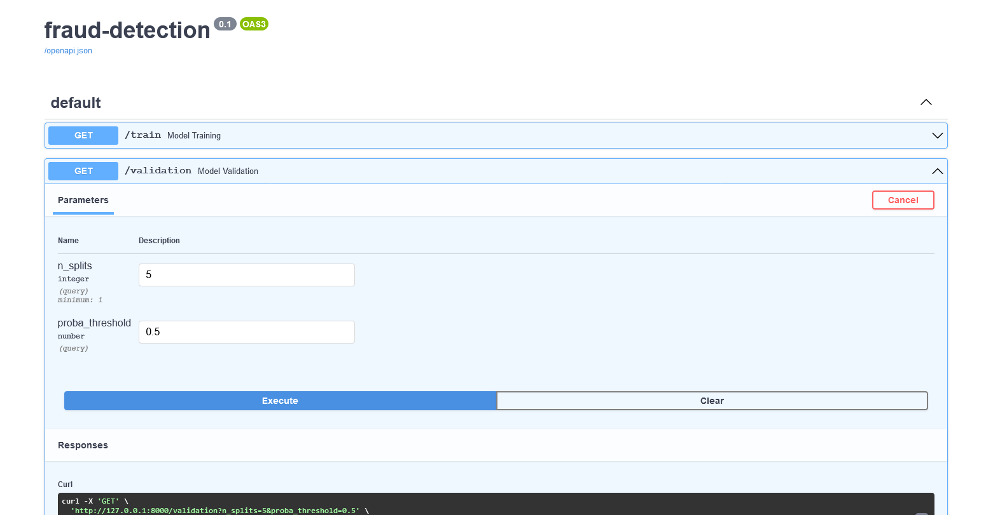

# Fraud detection model with FastAPI



This project is an example of a fully packaged machine learning model that can be readily deployed in any computing
environment:

- Gradient boosted trees as the core model using Microsoft's LightGBM implementation,
- Model training and finetuning using random search optimization,
- model exposition as a REST API using FastAPI framework,
- Docker to package the whole thing in a containerized run environment

The API exposes three end-points:

- `/train` to train and finetune the model on (X, y) training datasets fetched from a remote source. The data is pulled
  upon route call (design choice for the sake of simplicity) where a dedicated method in `app.services.data` handles
  that tu allow for easy modification.
- `/validation` to evaluate the model performance using cross-validation and report metrics on (X, y) validation
  datasets fetched from a remote source,
- `/prediction` for inference on a dataset passed as payload. It needs to be a list of samples but this list can contain
  only one item for point inference.

## Context

The business problem used as an example is the detection of fraudulent bank transactions. The dataset contains over 20k
transactions records described by 112 numerical features. The goal is to predict a binary outcome of either a
transaction is fraudulent or legit, hence it is a binary classification problem.

The model finetuning tries to maximize the recall (tp / (tp + fn)) as we want to find the maximum amount of fraudulent
transactions.

## How to use

Clone the repository in a local directory:

```
git clone https://github.com/clabrugere/fastapi-fraud-detection.git
```

Now you can either run the api locally or in a container.

### Locally

Navigate to the local directory containing the project, create a new environment and install requirements:

```
conda create --name fastapi-fraud-detection python=3.9
conda activate fastapi-fraud-detection
pip install -r requirements.txt
```

Then launch the server:

```
uvicorn app.main:app --reload
```

### In a container

Navigate to the local directory containing the project and build the docker image

```
docker build -t fastapi-fraud-detection .
```

Start the container

```
docker run -d --name fastapi-fraud-detection-instance -p 80:80 fastapi-fraud-detection
```

## Acknowledgements

- [Fraud detection bank dataset 20K records binary ](https://www.kaggle.com/volodymyrgavrysh/fraud-detection-bank-dataset-20k-records-binary)

## License

[MIT](LICENSE)
